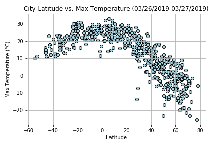
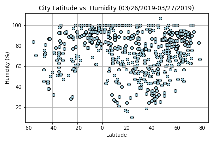
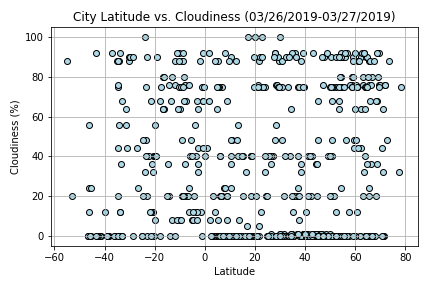
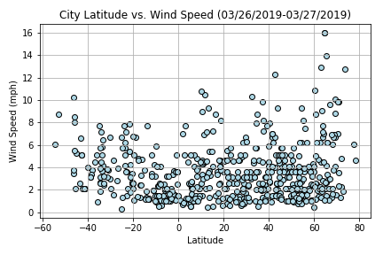

# APIs assignment

# PyWeather

This is a Python script to visualize the weather of 500+ cities across the world of varying distance from the equator. 
The scripts uses a Python library (https://pypi.python.org/pypi/citipy) and the OpenWeatherMap API 
(https://openweathermap.org/api) to create a representative model of weather across world cities.

A series of scatter plots are provided to showcase the relationships: Temperature (F) vs. Latitude, 
Humidity (%) vs. Latitude, Cloudiness (%) vs. Latitude, and Wind Speed (mph) vs. Latitude.

## Results

