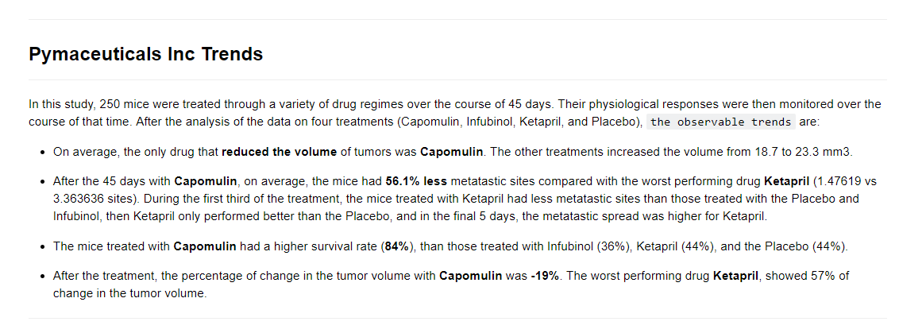
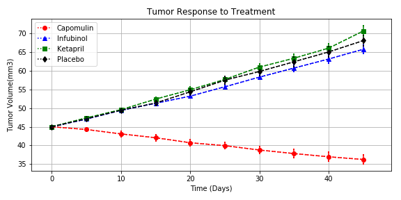
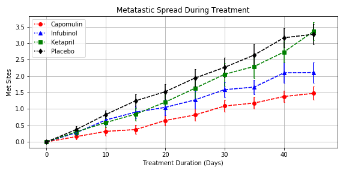
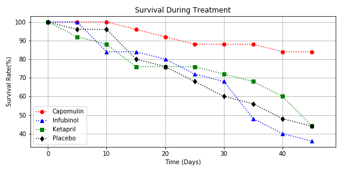
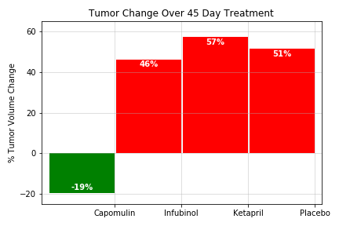

# Pymaceuticals - Matplotlib assignment

In this study, 250 mice were treated through a variety of drug regimes over the course of 45 days. 
Their physiological responses were then monitored over the course of that time.

## Results

